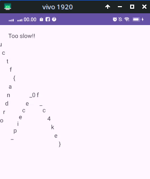

# Baby Android 1

> If you've never reverse engineered an Android application, now is the time!! Get to it, already!! Learn how they work!!

Diberikan file APK, di decompile menggunakan JADX, kemudian buka MainActivity

```java
package byuctf.downwiththefrench;

import android.os.Bundle;
import android.widget.TextView;
import androidx.appcompat.app.AppCompatActivity;

/* loaded from: classes3.dex */
public class MainActivity extends AppCompatActivity {
    @Override // androidx.fragment.app.FragmentActivity, androidx.activity.ComponentActivity, androidx.core.app.ComponentActivity, android.app.Activity
    protected void onCreate(Bundle savedInstanceState) {
        super.onCreate(savedInstanceState);
        setContentView(R.layout.activity_main);
        Utilities util = new Utilities(this);
        util.cleanUp();
        TextView homeText = (TextView) findViewById(R.id.homeText);
        homeText.setText("Too slow!!");
    }
}
```

Program akan menginisialisasi Utilities dan memanggil method cleanUp, kemudian menampilkan pesan "Too slow!!" ke aplikasi. Selanjutnya coba buka pada bagian file Utilities

```java
package byuctf.downwiththefrench;

import android.app.Activity;
import android.widget.TextView;

/* loaded from: classes3.dex */
public class Utilities {
    private Activity activity;

    public Utilities(Activity activity) {
        this.activity = activity;
    }

    public void cleanUp() {
        TextView flag = (TextView) this.activity.findViewById(R.id.flagPart1);
        flag.setText("");
        TextView flag2 = (TextView) this.activity.findViewById(R.id.flagPart2);
        flag2.setText("");
        TextView flag3 = (TextView) this.activity.findViewById(R.id.flagPart3);
        flag3.setText("");
        TextView flag4 = (TextView) this.activity.findViewById(R.id.flagPart4);
        flag4.setText("");
        TextView flag5 = (TextView) this.activity.findViewById(R.id.flagPart5);
        flag5.setText("");
        TextView flag6 = (TextView) this.activity.findViewById(R.id.flagPart6);
        flag6.setText("");
        TextView flag7 = (TextView) this.activity.findViewById(R.id.flagPart7);
        flag7.setText("");
        TextView flag8 = (TextView) this.activity.findViewById(R.id.flagPart8);
        flag8.setText("");
        TextView flag9 = (TextView) this.activity.findViewById(R.id.flagPart9);
        flag9.setText("");
        TextView flag10 = (TextView) this.activity.findViewById(R.id.flagPart10);
        flag10.setText("");
        TextView flag11 = (TextView) this.activity.findViewById(R.id.flagPart11);
        flag11.setText("");
        TextView flag12 = (TextView) this.activity.findViewById(R.id.flagPart12);
        flag12.setText("");
        TextView flag13 = (TextView) this.activity.findViewById(R.id.flagPart13);
        flag13.setText("");
        TextView flag14 = (TextView) this.activity.findViewById(R.id.flagPart14);
        flag14.setText("");
        TextView flag15 = (TextView) this.activity.findViewById(R.id.flagPart15);
        flag15.setText("");
        TextView flag16 = (TextView) this.activity.findViewById(R.id.flagPart16);
        flag16.setText("");
        TextView flag17 = (TextView) this.activity.findViewById(R.id.flagPart17);
        flag17.setText("");
        TextView flag18 = (TextView) this.activity.findViewById(R.id.flagPart18);
        flag18.setText("");
        TextView flag19 = (TextView) this.activity.findViewById(R.id.flagPart19);
        flag19.setText("");
        TextView flag20 = (TextView) this.activity.findViewById(R.id.flagPart20);
        flag20.setText("");
        TextView flag21 = (TextView) this.activity.findViewById(R.id.flagPart21);
        flag21.setText("");
        TextView flag22 = (TextView) this.activity.findViewById(R.id.flagPart22);
        flag22.setText("");
        TextView flag23 = (TextView) this.activity.findViewById(R.id.flagPart23);
        flag23.setText("");
        TextView flag24 = (TextView) this.activity.findViewById(R.id.flagPart24);
        flag24.setText("");
        TextView flag25 = (TextView) this.activity.findViewById(R.id.flagPart25);
        flag25.setText("");
        TextView flag26 = (TextView) this.activity.findViewById(R.id.flagPart26);
        flag26.setText("");
        TextView flag27 = (TextView) this.activity.findViewById(R.id.flagPart27);
        flag27.setText("");
        TextView flag28 = (TextView) this.activity.findViewById(R.id.flagPart28);
        flag28.setText("");
    }
}
```

Ternyata method cleanUp berfungsi untuk men-set nilai dari flagPart1-flagPart28 menjadi string kosong "". Kita coba buka isi dari flagPart nya ini sebelum dilakukan cleanUp di res/layout/activity_main.xml

```xml
<?xml version="1.0" encoding="utf-8"?>
<androidx.constraintlayout.widget.ConstraintLayout android:layout_width="fill_parent" android:layout_height="fill_parent"
  xmlns:android="http://schemas.android.com/apk/res/android" xmlns:app="http://schemas.android.com/apk/res-auto">
    <TextView android:id="@id/homeText" android:layout_width="wrap_content" android:layout_height="wrap_content" android:text="b" app:layout_constraintBottom_toBottomOf="parent" app:layout_constraintEnd_toEndOf="parent" app:layout_constraintHorizontal_bias="0.066" app:layout_constraintStart_toStartOf="parent" app:layout_constraintTop_toTopOf="parent" app:layout_constraintVertical_bias="0.022" />
    <TextView android:id="@id/flagPart1" android:layout_width="wrap_content" android:layout_height="wrap_content" android:layout_marginBottom="420.0dip" android:text="}" android:layout_marginEnd="216.0dip" app:layout_constraintBottom_toBottomOf="parent" app:layout_constraintEnd_toEndOf="parent" />
    <TextView android:id="@id/flagPart2" android:layout_width="wrap_content" android:layout_height="wrap_content" android:layout_marginBottom="616.0dip" android:text="t" android:layout_marginEnd="340.0dip" app:layout_constraintBottom_toBottomOf="parent" app:layout_constraintEnd_toEndOf="parent" />
    <TextView android:id="@id/flagPart3" android:layout_width="wrap_content" android:layout_height="wrap_content" android:layout_marginBottom="556.0dip" android:text="a" android:layout_marginEnd="332.0dip" app:layout_constraintBottom_toBottomOf="parent" app:layout_constraintEnd_toEndOf="parent" />
    <TextView android:id="@id/flagPart4" android:layout_width="wrap_content" android:layout_height="wrap_content" android:layout_marginBottom="676.0dip" android:text="y" android:layout_marginEnd="368.0dip" app:layout_constraintBottom_toBottomOf="parent" app:layout_constraintEnd_toEndOf="parent" />
    <TextView android:id="@id/flagPart5" android:layout_width="wrap_content" android:layout_height="wrap_content" android:layout_marginBottom="500.0dip" android:text="c" android:layout_marginEnd="252.0dip" app:layout_constraintBottom_toBottomOf="parent" app:layout_constraintEnd_toEndOf="parent" />
    <TextView android:id="@id/flagPart6" android:layout_width="wrap_content" android:layout_height="wrap_content" android:layout_marginBottom="636.0dip" android:text="c" android:layout_marginEnd="348.0dip" app:layout_constraintBottom_toBottomOf="parent" app:layout_constraintEnd_toEndOf="parent" />
    <TextView android:id="@id/flagPart7" android:layout_width="wrap_content" android:layout_height="wrap_content" android:layout_marginBottom="436.0dip" android:text="d" android:layout_marginEnd="364.0dip" app:layout_constraintBottom_toBottomOf="parent" app:layout_constraintEnd_toEndOf="parent" />
    <TextView android:id="@id/flagPart8" android:layout_width="wrap_content" android:layout_height="wrap_content" android:layout_marginBottom="496.0dip" android:text="r" android:layout_marginEnd="348.0dip" app:layout_constraintBottom_toBottomOf="parent" app:layout_constraintEnd_toEndOf="parent" />
    <TextView android:id="@id/flagPart9" android:layout_width="wrap_content" android:layout_height="wrap_content" android:layout_marginBottom="536.0dip" android:text="n" android:layout_marginEnd="336.0dip" app:layout_constraintBottom_toBottomOf="parent" app:layout_constraintEnd_toEndOf="parent" />
    <TextView android:id="@id/flagPart10" android:layout_width="wrap_content" android:layout_height="wrap_content" android:layout_marginBottom="456.0dip" android:text="i" android:layout_marginEnd="360.0dip" app:layout_constraintBottom_toBottomOf="parent" app:layout_constraintEnd_toEndOf="parent" />
    <TextView android:id="@id/flagPart11" android:layout_width="wrap_content" android:layout_height="wrap_content" android:layout_marginBottom="536.0dip" android:text="0" android:layout_marginEnd="276.0dip" app:layout_constraintBottom_toBottomOf="parent" app:layout_constraintEnd_toEndOf="parent" />
    <TextView android:id="@id/flagPart12" android:layout_width="wrap_content" android:layout_height="wrap_content" android:layout_marginBottom="516.0dip" android:text="d" android:layout_marginEnd="340.0dip" app:layout_constraintBottom_toBottomOf="parent" app:layout_constraintEnd_toEndOf="parent" />
    <TextView android:id="@id/flagPart13" android:layout_width="wrap_content" android:layout_height="wrap_content" android:layout_marginBottom="460.0dip" android:text="k" android:layout_marginEnd="232.0dip" app:layout_constraintBottom_toBottomOf="parent" app:layout_constraintEnd_toEndOf="parent" />
    <TextView android:id="@id/flagPart14" android:layout_width="wrap_content" android:layout_height="wrap_content" android:layout_marginBottom="656.0dip" android:text="u" android:layout_marginEnd="356.0dip" app:layout_constraintBottom_toBottomOf="parent" app:layout_constraintEnd_toEndOf="parent" />
    <TextView android:id="@id/flagPart15" android:layout_width="wrap_content" android:layout_height="wrap_content" android:layout_marginBottom="452.0dip" android:text="p" android:layout_marginEnd="320.0dip" app:layout_constraintBottom_toBottomOf="parent" app:layout_constraintEnd_toEndOf="parent" />
    <TextView android:id="@id/flagPart16" android:layout_width="wrap_content" android:layout_height="wrap_content" android:layout_marginBottom="476.0dip" android:text="o" android:layout_marginEnd="352.0dip" app:layout_constraintBottom_toBottomOf="parent" app:layout_constraintEnd_toEndOf="parent" />
    <TextView android:id="@id/flagPart17" android:layout_width="wrap_content" android:layout_height="wrap_content" android:layout_marginBottom="500.0dip" android:text="c" android:layout_marginEnd="300.0dip" app:layout_constraintBottom_toBottomOf="parent" app:layout_constraintEnd_toEndOf="parent" />
    <TextView android:id="@id/flagPart18" android:layout_width="wrap_content" android:layout_height="wrap_content" android:layout_marginBottom="596.0dip" android:text="f" android:layout_marginEnd="332.0dip" app:layout_constraintBottom_toBottomOf="parent" app:layout_constraintEnd_toEndOf="parent" />
    <TextView android:id="@id/flagPart19" android:layout_width="wrap_content" android:layout_height="wrap_content" android:layout_marginBottom="484.0dip" android:text="e" android:layout_marginEnd="308.0dip" app:layout_constraintBottom_toBottomOf="parent" app:layout_constraintEnd_toEndOf="parent" />
    <TextView android:id="@id/flagPart20" android:layout_width="wrap_content" android:layout_height="wrap_content" android:layout_marginBottom="436.0dip" android:text="_" android:layout_marginEnd="328.0dip" app:layout_constraintBottom_toBottomOf="parent" app:layout_constraintEnd_toEndOf="parent" />
    <TextView android:id="@id/flagPart21" android:layout_width="wrap_content" android:layout_height="wrap_content" android:layout_marginBottom="516.0dip" android:text="e" android:layout_marginEnd="292.0dip" app:layout_constraintBottom_toBottomOf="parent" app:layout_constraintEnd_toEndOf="parent" />
    <TextView android:id="@id/flagPart22" android:layout_width="wrap_content" android:layout_height="wrap_content" android:layout_marginBottom="536.0dip" android:text="_" android:layout_marginEnd="284.0dip" app:layout_constraintBottom_toBottomOf="parent" app:layout_constraintEnd_toEndOf="parent" />
    <TextView android:id="@id/flagPart23" android:layout_width="wrap_content" android:layout_height="wrap_content" android:layout_marginBottom="536.0dip" android:text="f" android:layout_marginEnd="268.0dip" app:layout_constraintBottom_toBottomOf="parent" app:layout_constraintEnd_toEndOf="parent" />
    <TextView android:id="@id/flagPart24" android:layout_width="wrap_content" android:layout_height="wrap_content" android:layout_marginBottom="468.0dip" android:text="i" android:layout_marginEnd="316.0dip" app:layout_constraintBottom_toBottomOf="parent" app:layout_constraintEnd_toEndOf="parent" />
    <TextView android:id="@id/flagPart25" android:layout_width="wrap_content" android:layout_height="wrap_content" android:layout_marginBottom="516.0dip" android:text="_" android:layout_marginEnd="260.0dip" app:layout_constraintBottom_toBottomOf="parent" app:layout_constraintEnd_toEndOf="parent" />
    <TextView android:id="@id/flagPart26" android:layout_width="wrap_content" android:layout_height="wrap_content" android:layout_marginBottom="480.0dip" android:text="4" android:layout_marginEnd="240.0dip" app:layout_constraintBottom_toBottomOf="parent" app:layout_constraintEnd_toEndOf="parent" />
    <TextView android:id="@id/flagPart27" android:layout_width="wrap_content" android:layout_height="wrap_content" android:layout_marginBottom="440.0dip" android:text="e" android:layout_marginEnd="224.0dip" app:layout_constraintBottom_toBottomOf="parent" app:layout_constraintEnd_toEndOf="parent" />
    <TextView android:id="@id/flagPart28" android:layout_width="wrap_content" android:layout_height="wrap_content" android:layout_marginBottom="576.0dip" android:text="{" android:layout_marginEnd="324.0dip" app:layout_constraintBottom_toBottomOf="parent" app:layout_constraintEnd_toEndOf="parent" />
</androidx.constraintlayout.widget.ConstraintLayout>
```

Flag didefinisikan pada nilai android:text di setiap flagPart, namun ini masih sangat random, saya coba membentuk ulang flagnya dengan pola value dari android:layout_marginBottom namun tidak berhasil, lalu saya coba untuk melakukan patching APK.

Idenya sederhana, kita hanya perlu edit method cleanUp supaya tidak men-set flagPartnya menjadi string kosong "". Karena pada JADX tidak bisa dilakukan editing, maka kita langsung saja ubah bentuk smalinya pada hasil ekstraksi menggunakan apktool.

```smali
.method public cleanUp()V
    .registers 5

    .line 15
    iget-object v0, p0, Lbyuctf/downwiththefrench/Utilities;->activity:Landroid/app/Activity;

    sget v1, Lbyuctf/downwiththefrench/R$id;->flagPart1:I

    invoke-virtual {v0, v1}, Landroid/app/Activity;->findViewById(I)Landroid/view/View;

    move-result-object v0

    check-cast v0, Landroid/widget/TextView;

    .line 16
    .local v0, "flag":Landroid/widget/TextView;
    const-string v1, ""

    invoke-virtual {v0, v1}, Landroid/widget/TextView;->setText(Ljava/lang/CharSequence;)V

    iget-object v2, p0, Lbyuctf/downwiththefrench/Utilities;->activity:Landroid/app/Activity;

    sget v3, Lbyuctf/downwiththefrench/R$id;->flagPart2:I

    invoke-virtual {v2, v3}, Landroid/app/Activity;->findViewById(I)Landroid/view/View;

    move-result-object v2

    move-object v0, v2

    check-cast v0, Landroid/widget/TextView;
    ...
```

Hapus pada saat flagPart di set ke string kosong. Sehingga nantinya method cleanUp berisi 

```smali
.method public cleanUp()V
    .locals 4

    .line 15
    iget-object v0, p0, Lbyuctf/downwiththefrench/Utilities;->activity:Landroid/app/Activity;

    sget v1, Lbyuctf/downwiththefrench/R$id;->flagPart1:I

    invoke-virtual {v0, v1}, Landroid/app/Activity;->findViewById(I)Landroid/view/View;

    move-result-object v0

    check-cast v0, Landroid/widget/TextView;

    .line 16
    .local v0, "flag":Landroid/widget/TextView;

    .line 51
    return-void
.end method
```

Langsung saja kita rebuild menggunakan apktool

`$ apktool b baby-android-1 -o patched.apk`

Kemudian kita atur alignment karena pada Android 11 (API level 30) mewajibkan file resources.arsc harus tidak dikompresi dan di align ke 4 byte.

`$ zipalign -p -f 4 patched.apk aligned.apk`

Dan sign menggunakan apksigner

`$ apksigner sign --ks a.keystore --ks-key-alias akey aligned.apk`

Lalu install APK tersebut ke device.

`$ adb install -r aligned.apk`



Terdapat bagian flag yang terpotong, kita tinggal cocokkan dengan hasil activity_main.xml, dan didapatkan flagnya byuctf{android_piece_0f_c4ke}