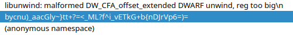

# Baby Android 2

> If you've never reverse engineered an Android application, now is the time!! Get to it, already!! Learn more about how they work!!

Diberikan file APK, langsung saja di decompile menggunakan tools JADX. Buka pada bagian MainActivity.

```java
package byuctf.babyandroid;

import android.os.Bundle;
import android.view.View;
import android.widget.Button;
import android.widget.EditText;
import android.widget.TextView;
import androidx.activity.EdgeToEdge;
import androidx.appcompat.app.AppCompatActivity;

/* loaded from: classes4.dex */
public class MainActivity extends AppCompatActivity {
    private EditText flag;
    private Button sanityCheck;

    @Override // androidx.fragment.app.FragmentActivity, androidx.activity.ComponentActivity, androidx.core.app.ComponentActivity, android.app.Activity
    protected void onCreate(Bundle savedInstanceState) {
        super.onCreate(savedInstanceState);
        EdgeToEdge.enable(this);
        setContentView(R.layout.activity_main);
        this.flag = (EditText) findViewById(R.id.flag_input);
        Button button = (Button) findViewById(R.id.sanity_check_button);
        this.sanityCheck = button;
        button.setOnClickListener(new View.OnClickListener() { // from class: byuctf.babyandroid.MainActivity.1
            @Override // android.view.View.OnClickListener
            public void onClick(View view) {
                String flagAttempt = MainActivity.this.flag.getText().toString();
                TextView banner = (TextView) MainActivity.this.findViewById(R.id.banner);
                if (FlagChecker.check(flagAttempt)) {
                    banner.setText("That's the right flag!!!");
                } else {
                    banner.setText("Nope! Try again if you'd like");
                }
            }
        });
    }
}
```

Programnya sangat sederhana, pengguna dapat melakukan input flag `this.flag = (EditText) findViewById(R.id.flag_input);` dan nantinya input tersebut akan dicek menggunakan fungsi FlagChecker dengan method check `FlagChecker.check(flagAttempt)`. 

Berikut adalah isi dari fungsi FlagChecker

```java
package byuctf.babyandroid;

/* loaded from: classes4.dex */
public class FlagChecker {
    public static native boolean check(String str);

    static {
        System.loadLibrary("babyandroid");
    }
}
```

Fungsi FlagChecker mengambil library babyandroid, kita bisa ekstrak APK nya menggunakan apktool untuk mengakses librarynya. Kita cari library dalam folder APK yang sudah di ekstrak pada bagian lib/x86_64, langsung saja buka menggunakan IDA.

Cari melalui string dan terdapat indikasi flag yang benar



Setelah di klik string itu mengarah ke section .rodata yang disimpan dalam label aBycnuAacglyTtM, lalu cek pada bagian xref untuk mengetahui kapan label ini dipanggil, dan kita menemukan fungsi FlagChecker

```c++
__int64 __fastcall Java_byuctf_babyandroid_FlagChecker_check(__int64 a1, __int64 a2, __int64 a3)
{
  __int64 StringUTFChars; // rax
  int i; // [rsp+10h] [rbp-50h]
  unsigned __int8 v6; // [rsp+3Fh] [rbp-21h]
  _BYTE v7[24]; // [rsp+40h] [rbp-20h] BYREF
  unsigned __int64 v8; // [rsp+58h] [rbp-8h]

  v8 = __readfsqword(0x28u);
  StringUTFChars = _JNIEnv::GetStringUTFChars(a1, a3, 0LL);
  std::string::basic_string<decltype(nullptr)>(v7, StringUTFChars);
  if ( sub_206F0(v7) == 23 )
  {
    for ( i = 0; i < 23; ++i )
    {
      if ( *sub_20710(v7, i) != aBycnuAacglyTtM[i * i % 47] )
      {
        v6 = 0;
        goto LABEL_9;
      }
    }
    v6 = 1;
  }
  else
  {
    v6 = 0;
  }
LABEL_9:
  std::string::~string(v7);
  return v6;
}
```

v7 kemungkinan adalah input kita, pertama input kita akan dicek panjangnya dulu `sub_206F0(v7) == 23` kemudian akan dilakukan perulangan untuk mengakses setiap karakter dan mencocokkan nilai dari label aBycnuAacglyTtM. Langsung saja tulis solvernya.

```python
a = list(b'bycnu)_aacGly~}tt+?=<_ML?f^i_vETkG+b{nDJrVp6=)=')

flag_len = 23
flag = ''.join(chr(a[(i * i) % 47]) for i in range(flag_len))
print(flag)
```

Didapatkan flagnya byuctf{c++_in_an_apk??}