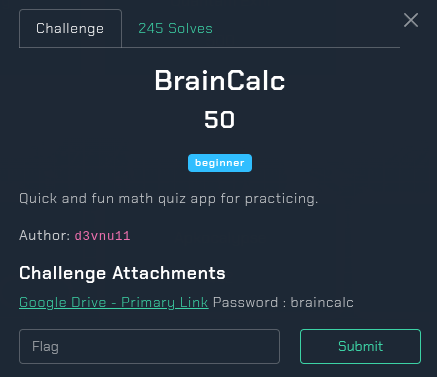
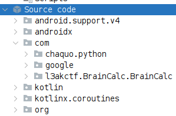

## BrainCalc



**Challenge:** BrainCalc<br/>
**Category:** Mobile<br/>
**Points:** 50<br/>

### Introduction

We are given an .apk file. The first step is to open it in JADX to inspect the source code.

### Analyzing the app-debug1.apk File 



In the com folder, we notice that the app uses chaquo.python, which indicates that the application was built using python via the Chaquopy framework. Our goal is to extract the source code.

Use apktool to decompile the APK

```
$ apktool d app-debug1.apk
```

Navigate to the assets/chaquopy directory

```
app.imy           cacert.pem                  stdlib-arm64-v8a.imy
bootstrap.imy     requirements-arm64-v8a.imy  stdlib-common.imy
bootstrap-native  requirements-common.imy     stdlib-x86_64.imy
build.json        requirements-x86_64.imy
```

Here we see several .imy files (these are Chaquopy's internal formats). To extract them, use the unzip tool

```
$ unzip app.imy
```

We find a file named app.pyc. This is a compiled python file. To analyze it, we can decompile it using pylingual.io, an online .pyc decompiler.

We don’t need to read all of the source code, just focus on the get_secret_reward function:

```py
# assets/files/app.py
def get_secret_reward():
    compressed_flag = 'eJzzMXb0rvYqLS6JN4kPNynKjQ8tiHfOMMnJqQUAeHcJQA=='
    try:
        decoded = base64.b64decode(compressed_flag)
        flag = zlib.decompress(decoded).decode('utf-8')
        return flag
    except:
        return 'Error: Could not decode secret'
```

compressed_flag is a base64-encoded string. The function decodes it into bytes and then decompresses it using zlib, finally decoding the result into a UTF-8 string to get the flag.

### How to solve it?

To retrieve the flag, we can write a simple python script:

```py
import base64, zlib

compressed_flag = 'eJzzMXb0rvYqLS6JN4kPNynKjQ8tiHfOMMnJqQUAeHcJQA=='
decoded = base64.b64decode(compressed_flag)
flag = zlib.decompress(decoded).decode('utf-8')
print(flag)
```

Flag: L3AK{Just_4_W4rm_Up_Ch4ll}
