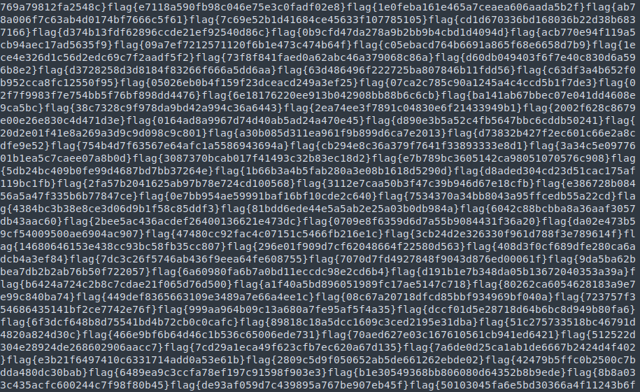
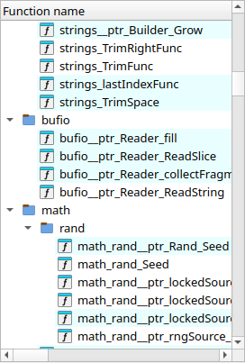
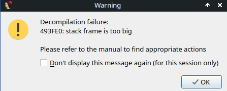
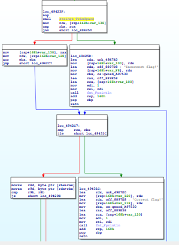
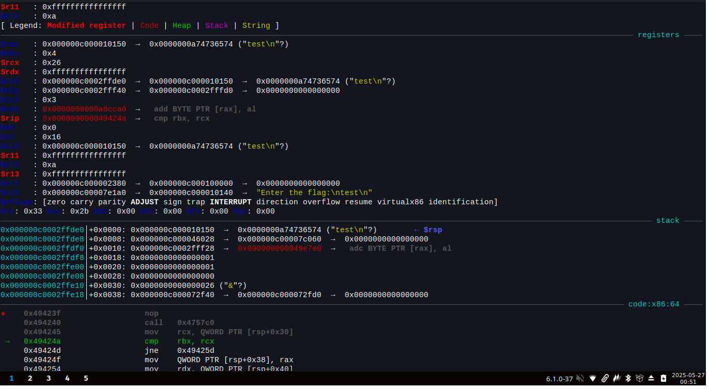
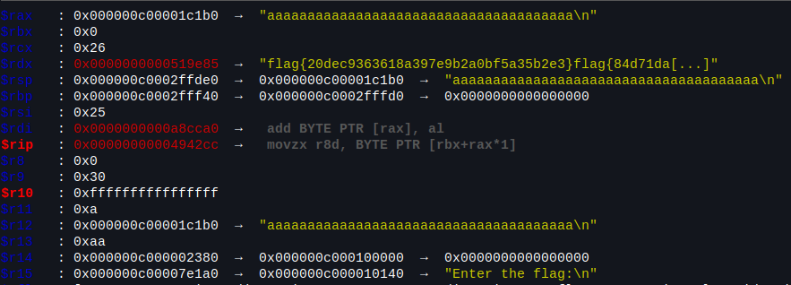

# FlagsFlagsFlags

> Did you see the strings? One of those is right, I can just feel it.

Diberikan file flagsflagsflags, identifikasi filenya.

```
$ file flagsflagsflags
flagsflagsflags: ELF 64-bit LSB executable, x86-64, version 1 (SYSV), statically linked, no section header
```

File ELF 64 bit dengan statically linked, karena outputnya no section header, ada kemungkinan binary dipack, coba ekstrak strings dari file

```
$ strings flagsflagsflags
...
UPX!
UPX!
```

Benar saja binarynya di pack menggunakan upx, langsung saja unpack

```bash
$ upx -d flagsflagsflags -o flagsflagsflags_unpacked
```

```bash
$ file flagsflagsflags_unpacked
flagsflagsflags_unpacked: ELF 64-bit LSB executable, x86-64, version 1 (SYSV), statically linked, BuildID[sha1]=8bbcb5450afeba98d27154e01464d3e4888218b7, stripped
```

Selain terdapat informasi UPX saat menggunakan strings, terdapat banyak sekali flag di dalam file tersebut.



Ketika program dijalankan maka akan meminta flag

```bash
$ ./flagsflagsflags_unpacked
Enter the flag:
test
Incorrect flag!
```

Buka binary yang sudah di unpack ke IDA.



Dari banyaknya nama function dan dari penamaannya dapat disimpulkan bahwa binary ini dibuat dengan Golang.

Berikut adalah hasil dekompilasi fungsi main_main

```go
void __fastcall main_main()
{
  __int64 v0; // rbx
  __int128 v1; // xmm15
  __int64 v2; // rbx
  int v3; // r8d
  int v4; // r9d
  int v5; // r10d
  int v6; // r11d
  __int64 *v7; // rdi
  __int64 v8; // rcx
  __int64 *v9; // rbp
  int v10; // r8d
  int v11; // r9d
  int v12; // r10d
  int v13; // r11d
  char *v14; // rsi
  int String; // eax
  __int64 v16; // rcx
  int v17; // r8d
  int v18; // r9d
  int v19; // r10d
  int v20; // r11d
  __int64 v21; // rax
  int v22; // r8d
  int v23; // r9d
  int v24; // r10d
  int v25; // r11d
  __int64 v26; // rcx
  __int64 v27; // rdx
  __int64 v28; // rbx
  int v29; // r8d
  int v30; // r9d
  __int64 *v31; // [rsp+0h] [rbp-178h]
  __int64 v32; // [rsp+10h] [rbp-168h] BYREF
  __int64 v33; // [rsp+18h] [rbp-160h]
  __int64 v34; // [rsp+20h] [rbp-158h]
  __int64 v35; // [rsp+28h] [rbp-150h]
  __int64 v36; // [rsp+30h] [rbp-148h]
  __int64 v37; // [rsp+38h] [rbp-140h]
  __int64 v38; // [rsp+40h] [rbp-138h]
  __int64 v39; // [rsp+48h] [rbp-130h]
  __int64 Flag; // [rsp+50h] [rbp-128h]
  _QWORD v41[2]; // [rsp+58h] [rbp-120h] BYREF
  _QWORD v42[2]; // [rsp+68h] [rbp-110h] BYREF
  _QWORD v43[2]; // [rsp+78h] [rbp-100h] BYREF
  _QWORD v44[2]; // [rsp+88h] [rbp-F0h] BYREF
  __int128 v45; // [rsp+98h] [rbp-E0h]
  __int128 v46; // [rsp+A8h] [rbp-D0h] BYREF
  __int64 v47; // [rsp+B8h] [rbp-C0h]
  _UNKNOWN **v48; // [rsp+C0h] [rbp-B8h]
  __int64 v49; // [rsp+C8h] [rbp-B0h]
  __int64 v50; // [rsp+F0h] [rbp-88h]
  __int64 v51; // [rsp+F8h] [rbp-80h]
  _OWORD v52[5]; // [rsp+100h] [rbp-78h] BYREF
  _QWORD v53[2]; // [rsp+158h] [rbp-20h] BYREF
  __int64 v54; // [rsp+168h] [rbp-10h]
  __int64 v55; // [rsp+170h] [rbp-8h] BYREF

  Flag = main_generateFlag();
  v38 = v0;
  v53[0] = &unk_49E7E0;
  v53[1] = &off_8897B8;
  v2 = qword_A97530;
  fmt_Fprintln(&off_889E58, qword_A97530, v53, 1, 1, v3, v4, v5, v6, v32, v33, v34, v35, v36);// Enter the flag:
  v54 = qword_A97528;
  v52[0] = v1;
  v7 = &v32 + 25;
  v31 = &v55;
  (loc_46E6F0)(qword_A97528, v2, v8, v7);
  v9 = v31;
  runtime_makeslice(&unk_49E860, 4096, 4096, v7, 1, v10, v11, v12, v13, v32, v33, v34);
  v46 = v1;
  v31 = v9;
  *&v46 = (loc_46E6F0)(&v32 + 14);
  *(&v46 + 1) = 4096LL;
  v47 = 4096LL;
  v48 = &off_889E38;
  v49 = v54;
  v50 = -1LL;
  v51 = -1LL;
  *&v52[0] = v46;
  v14 = &v46 + 8;
  (loc_46EA5A)(v52 + 8, &v46 + 8);
  String = bufio__ptr_Reader_ReadString(v52, 10LL);
  if ( v16 )
  {
    v45 = v1;
    v44[0] = &unk_49E7E0;
    v44[1] = &off_8897C8;
    *&v45 = *(v16 + 8);
    *(&v45 + 1) = v52 + 8;
    fmt_Fprintln(&off_889E58, qword_A97530, v44, 2, 2, v17, v18, v19, v20, v32, v33, v34, v35, v36);
  }
  else
  {
    v21 = strings_TrimSpace(String, 10, 0, v52 + 8, &v46 + 8, v17, v18, v19, v20, v32, v33);
    v26 = v38;
    if ( v38 == 10 )
    {
      v39 = v21;
      v27 = Flag;
      v28 = 0LL;
      while ( v26 > v28 )
      {
        v29 = *(v28 + v21);
        v30 = *(v27 + v28);
        if ( v30 != v29 )
        {
          v42[0] = &unk_49E7E0;
          v42[1] = &off_8897D8;
          fmt_Fprintln(&off_889E58, qword_A97530, v42, 1, 1, v29, v30, v24, v25, v32, v33, v34, v35, v36);
          return;
        }
        v37 = v28;
        time_Sleep(100000000, v28, v26, v52 + 8, v14, v29, v30, v24, v25, v32);
        v28 = v37 + 1;
        v26 = v38;
        v27 = Flag;
        LODWORD(v14) = v39;
        v21 = v39;
      }
      v41[0] = &unk_49E7E0;
      v41[1] = &off_8897E8;
      fmt_Fprintln(&off_889E58, qword_A97530, v41, 1, 1, v22, v23, v24, v25, v32, v33, v34, v35, v36);
    }
    else
    {
      v43[0] = &unk_49E7E0;
      v43[1] = &off_8897D8;
      fmt_Fprintln(&off_889E58, qword_A97530, v43, 1, 1, v22, v23, v24, v25, v32, v33, v34, v35, v36);
    }
  }
}
```

Terdapat fungsi main_generateFlag yang dipanggil di awal, tetapi ketika dicoba decompile error karena isi fungsinya terlalu besar.



Karena binary ini menggunakan Golang, langsung saja lakukan dynamic analysis agar mempermudah dalam memahami program ini bekerja, sebelum itu tentukan dulu fungsi yang akan di cek dengan breakpoint. 



Program akan menampilkan output "Correct flag!" jika inputannya benar, coba pasang breakpoint setelah input dimasukkan pada bagian loc_49423F.



Saya mencoba memasukkan input "test", ternyata input akan diolah terlebih dahulu menggunakan fungsi TrimSpace dan disimpan pada rbx, selanjutnya terdapat perintah `mov    rcx, QWORD PTR [rsp+0x30]` yang kemungkinan adalah panjang dari flag, kemudian dilakukan operasi `cmp rbx, rcx` untuk mengecek apakah rbx dengan rcx bernilai sama. Coba lagi masukkan dengan panjang string yang sesuai sepanjang 0x26 (38 dalam desimal), contohnya 'aaaaaaaaaaaaaaaaaaaaaaaaaaaaaaaaaaaaaa'.

Setelah memasukkan panjang input yang sama, berikut adalah nilai dalam register



Pada rdx terdapat dua potongan flag yang di load dengan string flag yang kedua terpotong, kemungkinan string flag pertama ini adalah flag yang benar, tetapi coba lanjutkan analisis.

Selanjutnya terdapat perintah ini

```asm
movzx  r8d, BYTE PTR [rbx+rax*1] ; ini adalah input
movzx  r9d, BYTE PTR [rdx+rbx*1] ; ini adalah flag yang benar
cmp    r9b, r8b
```

Perhatikan pada gambar register di atas, perintah ini akan menjumlahkan memory address rbx+rax dan disimpan ke r8d serta rdx+rbx ke r9d. Karena menggunakan BYTE PTR maka r8d berisi karakter pertama dari input ('a') dan r9d bernilai karakter pertama dari flag yang benar ('f'). Selanjutnya terdapat perintah cmp untuk membandingkan apakah nilai dari r9b dan r8b sama, jika sama maka akan dilakukan increment dan pengambilan satu byte karakter kedua dari r9b dan r8d, dan seterusnya menggunakan fungsi berikut

```asm
loc_49429E:
mov     [rsp+168h+var_140], rbx
mov     eax, 5F5E100h
call    time_Sleep
mov     rbx, [rsp+168h+var_140]
inc     rbx
mov     rcx, [rsp+168h+var_138]
mov     rdx, [rsp+168h+var_128]
mov     rsi, [rsp+168h+var_130]
mov     rax, rsi
```

Jika berbeda maka akan langsung menampilkan output "Incorrect flag!"

```asm
lea     rdx, unk_49E7E0
mov     [rsp+168h+var_110], rdx
lea     rdx, off_8897D8 ; "Incorrect flag!"
mov     [rsp+168h+var_108], rdx
mov     rbx, cs:qword_A97530
lea     rax, off_889E58
lea     rcx, [rsp+168h+var_110]
mov     edi, 1
mov     rsi, rdi
call    fmt_Fprintln
add     rsp, 160h
pop     rbp
retn
```

Dari proses menggunakan gdb tersebut dapat disimpulkan bahwa program ini akan meminta input pengguna, lalu menggunakan salah satu flag, dan input pengguna akan dicocokkan per-karakter hingga semuanya benar, jika ada satu karakter saja yang tidak sesuai, maka program akan mengeluarkan output "Incorrect flag!". Dapat terlihat dalam register-register tadi bahwa flag yang benar adalah flag{20dec9363618a397e9b2a0bf5a35b2e3}.

Ketika dijalankan

```bash
$ ./flagsflagsflags_unpacked
Enter the flag:
flag{20dec9363618a397e9b2a0bf5a35b2e3}
Correct flag!
```