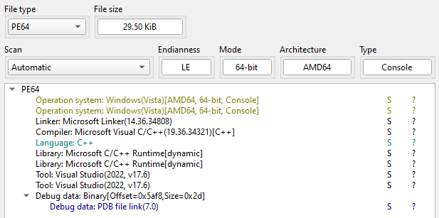
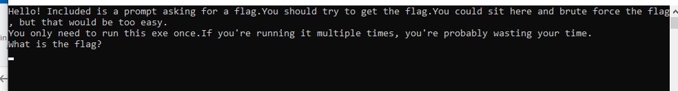

# No! Not again!

> Yeah, so... It's a crackme... It's in your FAVORITE language to Reverse Engineer!
Rust!

Diberikan file crackme-rust-fun.exe. Identifikasi filenya menggunakan Detect It Easy (DIE). Challenge PE 64-bit, C++. 



Ketika dijalankan program akan meminta input flag. Jika inputnya salah maka program akan terhenti.



Buka ke IDA, cari fungsi main.

```cpp
int __fastcall main(int argc, const char **argv, const char **envp)
{
  __int64 v3; // rax
  int result; // eax
  int v5; // esi
  char v6; // [rsp+2Fh] [rbp-19h] BYREF
  ULONG StackSizeInBytes[2]; // [rsp+30h] [rbp-18h] BYREF
  __int64 (__fastcall *v8[2])(); // [rsp+38h] [rbp-10h] BYREF

  v8[0] = main2;
  AddVectoredExceptionHandler(0, Handler);
  StackSizeInBytes[0] = 20480;
  SetThreadStackGuarantee(StackSizeInBytes);
  GetCurrentThread();
  off_140008000();
  v3 = *(*(NtCurrentTeb()->ThreadLocalStoragePointer + TlsIndex) + 8LL);
  if ( !v3 )
  {
    v3 = sub_140003F44();
    *(*(NtCurrentTeb()->ThreadLocalStoragePointer + TlsIndex) + 8LL) = v3;
  }
  qword_140008128 = v3;
  result = sub_140001000(v8);
  if ( dword_140008130 != 3 )
  {
    v6 = 1;
    *StackSizeInBytes = &v6;
    v5 = result;
    sub_140005731(&dword_140008130);
    return v5;
  }
  return result;
}
```

Setelah menginisiasi fungsi main2, program akan mensetup exception handling (AddVectoredExceptionHandler, yang juga biasa digunakan anti-debugging). Ketika dicek isi strings dari program dapat terlihat juga fungsi IsDebuggerPresent yang akan menyulitkan untuk melakukan dynamic analysis.

Berikut adalah isi fungsi main2

```cpp
__int64 __fastcall main2()
{
  unsigned int v0; // ebp
  unsigned int v1; // r12d
  __int64 v2; // rbx
  __int64 v3; // rsi
  __int64 v4; // r15
  __int64 v5; // r14
  unsigned __int8 v6; // al
  int v7; // edx
  char v8; // dl
  bool v9; // r15
  _QWORD *v10; // r14
  void *v11; // rdi
  char v12; // bl
  void *v13; // rdx
  void *v14; // r15
  __int64 v15; // rdi
  __int64 v16; // rbx
  __int64 v17; // rsi
  unsigned __int8 v18; // al
  unsigned __int8 v19; // dl
  char *Buffer; // r14
  unsigned __int64 v21; // r15
  unsigned __int64 v22; // r12
  char v23; // al
  void *v24; // rdx
  void *v25; // r13
  __int64 v26; // rax
  char v27; // r14
  ULONG Length; // eax
  int File; // eax
  char v30; // al
  unsigned __int64 v31; // rdx
  char v32; // al
  unsigned __int64 v33; // rdx
  char v34; // al
  char v35; // al
  unsigned __int64 v36; // rdx
  char v37; // cl
  __int64 v38; // rdx
  unsigned __int64 v39; // r15
  unsigned __int64 i; // r12
  unsigned __int64 v41; // r13
  char v42; // al
  unsigned __int64 v43; // rdx
  char v44; // al
  __int64 v45; // rdx
  __int64 v46; // rax
  unsigned __int64 v47; // r12
  unsigned __int64 v48; // r12
  unsigned __int8 *v49; // rsi
  __int64 v50; // rbx
  char v51; // di
  unsigned __int8 *v52; // rbx
  unsigned __int8 *v53; // r15
  unsigned __int8 *v54; // rdx
  unsigned __int8 *v55; // rdi
  __int64 v56; // rcx
  unsigned __int8 *v57; // r14
  int v58; // eax
  int v59; // r9d
  int v60; // r8d
  char v61; // al
  unsigned __int8 *v62; // r12
  unsigned __int8 *v63; // r13
  __int64 v64; // rcx
  char v65; // al
  char v66; // dl
  int v67; // edx
  int v68; // eax
  unsigned __int8 *v69; // r12
  unsigned __int8 *v70; // rdi
  unsigned __int64 v71; // rax
  __int64 v72; // rcx
  bool v73; // zf
  char **v74; // rax
  __int64 v76; // [rsp+48h] [rbp-2110h]
  __int64 v77; // [rsp+48h] [rbp-2110h]
  unsigned __int64 v78; // [rsp+50h] [rbp-2108h]
  _QWORD v79[2]; // [rsp+58h] [rbp-2100h] BYREF
  _QWORD *v80; // [rsp+68h] [rbp-20F0h] BYREF
  __int64 v81; // [rsp+70h] [rbp-20E8h]
  __int64 v82; // [rsp+78h] [rbp-20E0h]
  unsigned int v83; // [rsp+B4h] [rbp-20A4h]
  unsigned int v84; // [rsp+B8h] [rbp-20A0h]
  _QWORD v85[2]; // [rsp+C0h] [rbp-2098h] BYREF
  _QWORD v86[2]; // [rsp+D0h] [rbp-2088h] BYREF
  _QWORD v87[2]; // [rsp+E0h] [rbp-2078h] BYREF
  _QWORD v88[2]; // [rsp+F0h] [rbp-2068h] BYREF
  _BYTE IoStatusBlock[24]; // [rsp+100h] [rbp-2058h] BYREF
  __int64 v90; // [rsp+118h] [rbp-2040h]
  __int64 v91; // [rsp+120h] [rbp-2038h]
  unsigned int v92; // [rsp+14Ch] [rbp-200Ch]
  unsigned int v93; // [rsp+150h] [rbp-2008h]

  v88[0] = &unk_140006360;
  v88[1] = 149LL;
  v85[0] = &unk_1400063F5;
  v86[0] = &unk_14000645F;
  v80 = v88;
  v81 = sub_14000117E;
  *IoStatusBlock = &unk_140006498;
  *&IoStatusBlock[8] = 2LL;
  v91 = 0LL;
  v85[1] = 106LL;
  v86[1] = 17LL;
  *&IoStatusBlock[16] = &v80;
  v90 = 1LL;
  sub_140003E21();
  sub_1400043A9(IoStatusBlock, "b87a5dae3a3686ddd6f14ebcb4f4d49bIncorrect! The flag is not: ");
  v2 = *IoStatusBlock;
  v3 = *&IoStatusBlock[8];
  if ( __OFSUB__(-*IoStatusBlock, 1LL) )
  {
LABEL_10:
    *IoStatusBlock = 0;
    LODWORD(v91) = 16777472;
    v90 = 7LL;
    *&IoStatusBlock[8] = 0LL;
    WORD2(v91) = 1;
    sub_1400043A9(&v80, "b87a5dae3a3686ddd6f14ebcb4f4d49bIncorrect! The flag is not: ");
    v10 = v80;
    v11 = v81;
    if ( v80 == 0x8000000000000000LL )
    {
      v12 = 1;
    }
    else
    {
      v12 = sub_140002B12(v81, IoStatusBlock);
      v14 = v13;
      sub_140004189(v10, v11);
      v11 = v14;
    }
    if ( (v12 & 1) != 0 )
      goto LABEL_148;
    CloseHandle(v11);
    if ( (v3 & 3) == 1 )
    {
      v15 = *(v3 - 1);
      v16 = *(v3 + 7);
      if ( *v16 )
        (*v16)(*(v3 - 1));
      v17 = v3 - 1;
      if ( *(v16 + 8) )
        sub_140002130(v15, *(v16 + 16));
      sub_140002130(v17, 8LL);
    }
    goto LABEL_22;
  }
  sub_140002D59(&v80, *&IoStatusBlock[8], 0LL);
  LODWORD(v4) = v80;
  v5 = v81;
  if ( v80 == 2 && (v6 = sub_140002CB4(v81), ((v7 == 1920) & v6) != 0) )
  {
    sub_140002D59(IoStatusBlock, v3, 0x200000LL);
    v4 = *IoStatusBlock;
    if ( *IoStatusBlock == 2LL || (v1 = v92, v0 = v93, sub_140002D45(v92, v93), (v8 & 1) != 0) )
    {
      sub_14000300A(v4);
      v9 = 1;
      goto LABEL_9;
    }
    v77 = *&IoStatusBlock[8];
    sub_14000300A(v4);
    sub_140002CD4(v5);
    v5 = v77;
  }
  else
  {
    v1 = v83;
    v0 = v84;
  }
  v9 = v4 == 2;
LABEL_9:
  sub_140004189(v2, v3);
  v3 = v5;
  if ( v9 )
    goto LABEL_10;
  v18 = sub_140002D45(v1, v0);
  if ( ((v18 | v19) & 1) == 0 )
  {
    v80 = v85;
    *IoStatusBlock = &unk_140006498;
    *&IoStatusBlock[8] = 2LL;
    v91 = 0LL;
    v81 = sub_140001286;
    *&IoStatusBlock[16] = &v80;
    v90 = 1LL;
    sub_140003E21();
  }
LABEL_22:
  v80 = v86;
  *IoStatusBlock = &unk_140006498;
  *&IoStatusBlock[8] = 2LL;
  v91 = 0LL;
  v81 = sub_14000138E;
  *&IoStatusBlock[16] = &v80;
  v90 = 1LL;
  sub_140003E21();
  v80 = 0LL;
  v81 = 1LL;
  v82 = 0LL;
  if ( dword_1400080D8 != 3 )
  {
    *IoStatusBlock = &byte_1400080A0;
    *&IoStatusBlock[8] = v79;
    v87[0] = IoStatusBlock;
    sub_140005731(&dword_1400080D8);
  }
  if ( _InterlockedCompareExchange8(&byte_1400080A0, 1, 0) )
    sub_140005882(&byte_1400080A0);
  v76 = v82;
  while ( 1 )
  {
    while ( 1 )
    {
      Buffer = lpMultiByteStr;
      v21 = qword_1400080C0 - qword_1400080B8;
      if ( qword_1400080C0 > qword_1400080B8 )
        break;
      v22 = *&cbMultiByte;
      memset(lpMultiByteStr + qword_1400080C8, 0, *&cbMultiByte - qword_1400080C8);
      v23 = sub_1400030BA(4294967286LL);
      v25 = v24;
      if ( (v23 & 1) != 0 )
        goto LABEL_52;
      if ( !sub_140003101(v24) )
      {
        *IoStatusBlock = xmmword_140006710;
        Length = -1;
        if ( v22 < 0xFFFFFFFF )
          Length = v22;
        File = NtReadFile(v25, 0LL, 0LL, 0LL, IoStatusBlock, Buffer, Length, 0LL, 0LL);
        if ( File == 259 )
        {
          WaitForSingleObject(v25, 0xFFFFFFFF);
          File = *IoStatusBlock;
        }
        if ( File == -1073741807 )
        {
LABEL_40:
          v21 = 0LL;
        }
        else
        {
          if ( File == 259 )
            __fastfail(7u);
          if ( File < 0 )
          {
            v21 = (RtlNtStatusToDosError(File) << 32) | 2;
            sub_140003067(IoStatusBlock, v21);
            switch ( IoStatusBlock[0] )
            {
              case 0:
                if ( *&IoStatusBlock[4] == 232 || *&IoStatusBlock[4] == 109 )
                  goto LABEL_101;
                v34 = 1;
                goto LABEL_50;
              case 1:
                v37 = IoStatusBlock[1];
                goto LABEL_100;
              case 2:
              case 3:
                v37 = *(*&IoStatusBlock[8] + 16LL);
LABEL_100:
                v34 = 1;
                if ( v37 != 11 )
                  goto LABEL_50;
LABEL_101:
                sub_140002CD4(v21);
                break;
            }
            goto LABEL_40;
          }
          v21 = *&IoStatusBlock[8];
        }
        v34 = 0;
LABEL_50:
        if ( (v34 & 1) == 0 )
          goto LABEL_66;
        goto LABEL_51;
      }
      v26 = sub_1400036AE(MultiByteStr, Buffer);
      if ( v22 == v26 )
      {
        v21 = v22;
        v25 = 0LL;
        goto LABEL_68;
      }
      v78 = v26;
      if ( v22 - v26 >= 4 )
      {
        v35 = sub_140003716(v25, &unk_1400080D0);
        v21 = v36;
        if ( (v35 & 1) != 0 )
        {
          v34 = 1;
        }
        else
        {
          if ( v36 >= 0x1001 )
            goto LABEL_148;
          v34 = sub_140003868(IoStatusBlock, v36, Buffer, v22);
          v39 = v78;
          if ( (v34 & 1) != 0 )
            v39 = 0LL;
          v21 = v38 + v39;
        }
        goto LABEL_50;
      }
      *IoStatusBlock = 0;
      v30 = sub_140003716(v25, &unk_1400080D0);
      v21 = v31;
      if ( (v30 & 1) == 0 )
      {
        if ( v31 >= 2 )
          goto LABEL_148;
        v32 = sub_140003868(IoStatusBlock, v31, MultiByteStr, 4);
        v21 = v33;
        if ( (v32 & 1) == 0 )
        {
          byte_1400080D6 = v33;
          if ( v22 < v78 )
            goto LABEL_148;
          v21 = v78 + sub_1400036AE(MultiByteStr, &Buffer[v78]);
LABEL_66:
          if ( v21 > v22 )
            goto LABEL_148;
          goto LABEL_67;
        }
      }
LABEL_51:
      v25 = v21;
      if ( v21 )
      {
LABEL_52:
        if ( !sub_1400038BF(v25) )
        {
          v21 = 0LL;
          goto LABEL_68;
        }
        sub_140003B2A(v25);
      }
      v21 = 0LL;
LABEL_67:
      v25 = 0LL;
LABEL_68:
      qword_1400080B8 = 0LL;
      qword_1400080C0 = v21;
      qword_1400080C8 = v22;
      if ( !v25 )
        goto LABEL_72;
      v27 = 1;
      v21 = v25;
      switch ( v25 & 3 )
      {
        case 0:
LABEL_70:
          if ( *(v21 + 16) == 35 )
            goto LABEL_83;
          goto LABEL_108;
        case 1:
LABEL_80:
          if ( *(v21 + 15) == 35 )
            goto LABEL_83;
          goto LABEL_108;
        case 2:
          goto LABEL_109;
        case 3:
LABEL_82:
          if ( sub_140002D39(HIDWORD(v21)) != 35 )
          {
LABEL_108:
            v27 = 1;
            goto LABEL_109;
          }
LABEL_83:
          sub_140002CD4(v21);
          break;
      }
    }
    if ( !lpMultiByteStr )
    {
      v27 = 1;
      switch ( v21 & 3 )
      {
        case 0uLL:
          goto LABEL_70;
        case 1uLL:
          goto LABEL_80;
        case 2uLL:
          goto LABEL_109;
        case 3uLL:
          goto LABEL_82;
      }
    }
    Buffer = lpMultiByteStr + qword_1400080B8;
LABEL_72:
    if ( v21 > 0xF )
    {
      v41 = ((Buffer + 7) & 0xFFFFFFFFFFFFFFF8uLL) - Buffer;
      if ( v41 )
      {
        v42 = sub_140002ACB(Buffer, v41);
        if ( (v42 & 1) != 0 )
        {
          i = v43;
          goto LABEL_91;
        }
      }
      else
      {
        v41 = 0LL;
      }
      while ( v41 <= v21 - 16
           && ((*&Buffer[v41 + 8] ^ 0xA0A0A0A0A0A0A0ALL | (0x101010101010100LL
                                                         - (*&Buffer[v41 + 8] ^ 0xA0A0A0A0A0A0A0ALL))) & (*&Buffer[v41] | (0x101010101010100LL - (*&Buffer[v41] ^ 0xA0A0A0A0A0A0A0ALL))) & 0x8080808080808080uLL) == 0x8080808080808080uLL )
        v41 += 16LL;
      v44 = sub_140002ACB(&Buffer[v41], v21 - v41);
      i = v41 + v45;
      v42 = v44 & 1;
    }
    else
    {
      for ( i = 0LL; ; ++i )
      {
        if ( v21 == i )
        {
          i = v21;
          v42 = 0;
          goto LABEL_91;
        }
        if ( Buffer[i] == 10 )
          break;
      }
      v42 = 1;
    }
LABEL_91:
    if ( (v42 & 1) != 0 )
      break;
    sub_14000215C(&v80, Buffer, v21);
    v46 = v21 + qword_1400080B8;
    if ( qword_1400080C0 < v21 + qword_1400080B8 )
      v46 = qword_1400080C0;
    qword_1400080B8 = v46;
    if ( !v21 )
      goto LABEL_107;
  }
  if ( i == -1LL || i >= v21 )
    goto LABEL_148;
  v47 = i + 1;
  sub_14000215C(&v80, Buffer, v47);
  v48 = qword_1400080B8 + v47;
  if ( qword_1400080C0 < v48 )
    v48 = qword_1400080C0;
  qword_1400080B8 = v48;
LABEL_107:
  v27 = 0;
LABEL_109:
  v49 = v81;
  v50 = v82;
  sub_1400028F1(IoStatusBlock, v81 + v76, v82 - v76);
  v51 = IoStatusBlock[0];
  if ( IoStatusBlock[0] )
    v50 = v76;
  v82 = v50;
  sub_140003B86(&byte_1400080A0);
  if ( (v51 & 1) != 0 || v27 )
LABEL_148:
    BUG();
  v52 = &v49[v50];
  v53 = 0LL;
  v54 = v49;
  do
  {
    v55 = v53;
    if ( v54 == v52 )
    {
      v57 = v52;
LABEL_126:
      v62 = 0LL;
      v55 = 0LL;
      break;
    }
    v56 = *v54;
    if ( (v56 & 0x80u) != 0LL )
    {
      v58 = v56 & 0x1F;
      v59 = v54[1] & 0x3F;
      if ( v56 <= 0xDFu )
      {
        v57 = v54 + 2;
        v56 = v59 | (v58 << 6);
      }
      else
      {
        v60 = (v59 << 6) | v54[2] & 0x3F;
        if ( v56 < 0xF0u )
        {
          v57 = v54 + 3;
          v56 = (v58 << 12) | v60;
        }
        else
        {
          v57 = v54 + 4;
          v56 = ((v56 & 7) << 18) | (v60 << 6) | v54[3] & 0x3Fu;
          if ( v56 == 1114112 )
            goto LABEL_126;
        }
      }
    }
    else
    {
      v57 = v54 + 1;
    }
    v53 += v57 - v54;
    v61 = sub_140001028(v56);
    v54 = v57;
    v62 = v53;
  }
  while ( v61 );
  while ( v57 != v52 )
  {
    v63 = v52;
    v64 = *(v52 - 1);
    if ( v64 < 0 )
    {
      v65 = *(v52 - 2);
      if ( v65 >= -64 )
      {
        v52 -= 2;
        v68 = v65 & 0x1F;
      }
      else
      {
        v66 = *(v52 - 3);
        if ( v66 >= -64 )
        {
          v52 -= 3;
          v67 = v66 & 0xF;
        }
        else
        {
          v52 -= 4;
          v67 = ((*(v63 - 4) & 7) << 6) | v66 & 0x3F;
        }
        v68 = (v67 << 6) | v65 & 0x3F;
      }
      v64 = (v68 << 6) | (v64 & 0x3F);
      if ( v64 == 1114112 )
        break;
    }
    else
    {
      --v52;
    }
    if ( !sub_140001028(v64) )
    {
      v62 = &v63[v53 - v57];
      break;
    }
  }
  v69 = (v62 - v55);
  v70 = &v55[v49];
  v79[0] = v70;
  v79[1] = v69;
  if ( v69 == 38 )
  {
    v71 = 0xDFB432BC61353FB0uLL;
    v72 = 0LL;
    while ( v72 != 38 )
    {
      v71 = 0xCFA8C7711A026A35uLL - 0x453E9537620FF1E3LL * v71;
      v73 = (v70[v72] ^ (v71 >> 21)) == byte_140006470[v72];
      ++v72;
      if ( !v73 )
        goto LABEL_143;
    }
    v87[0] = v79;
    v74 = &off_140006530;
  }
  else
  {
LABEL_143:
    v87[0] = v79;
    v74 = &off_1400064F8;
  }
  *IoStatusBlock = v74;
  *&IoStatusBlock[8] = 2LL;
  v91 = 0LL;
  v87[1] = sub_1400028DF;
  *&IoStatusBlock[16] = v87;
  v90 = 1LL;
  sub_140003E21();
  return sub_1400022C2(v80, v49);
}
```

Fokus pada bagian ini

```cpp
if ( v69 == 38 )
  {
    v71 = 0xDFB432BC61353FB0uLL;
    v72 = 0LL;
    while ( v72 != 38 )
    {
      v71 = 0xCFA8C7711A026A35uLL - 0x453E9537620FF1E3LL * v71;
      v73 = (v70[v72] ^ (v71 >> 21)) == byte_140006470[v72];
      ++v72;
      if ( !v73 )
        goto LABEL_143;
    }
    v87[0] = v79;
    v74 = &off_140006530;
  }
  else
  {
LABEL_143:
    v87[0] = v79;
    v74 = &off_1400064F8;
  }
```

v69 akan menghitung apakah panjang inputnya 38, jika bernilai true, maka akan terdapat Linear Congruential Generator (LCG) yang sudah diinisialisasi nilai awal sebelumnya yang berguna sebagai pseudo-random (berbasis angka) yang akan digunakan sebagai xor key. Lalu input akan di akses byte per byte (v70[v72]) kemudian di xor kan dengan 8-bit awal dari v71 (right shiftted 21), yang akhirnya akan dibandingkan dengan value dari byte_140006470[v72].

Buat solvernya dan ekstrak value dari byte_140006470.

```python
flag = [
    0x3A, 0x77, 0x2C, 0xA8, 0x0A, 0x82, 0xD2, 0x7F, 0x55, 0x11,
    0x40, 0xB6, 0x62, 0x64, 0x8C, 0x39, 0x4E, 0xDE, 0xCB, 0x8B,
    0x91, 0x49, 0x60, 0xA8, 0xF1, 0x2F, 0xBD, 0xE5, 0xE0, 0x7B,
    0xDB, 0xDA, 0x7B, 0xD3, 0x33, 0x04, 0x28, 0x9E
]

v71 = 0xDFB432BC61353FB0
mul = 0x453E9537620FF1E3
sub = 0xCFA8C7711A026A35

decrypted_flag = []

for i in range(38):
    v71 = (sub - mul * v71) & 0xFFFFFFFFFFFFFFFF 
    
    key = (v71 >> 21) & 0xFF
    
    decrypted_flag.append(flag[i] ^ key)

flag = bytes(decrypted_flag).decode('utf-8')
print(f"Flag: {flag}")
```

Didapatkan flagnya flag{ed817c62d7f7dcdb05c0f6e520a7069e}.