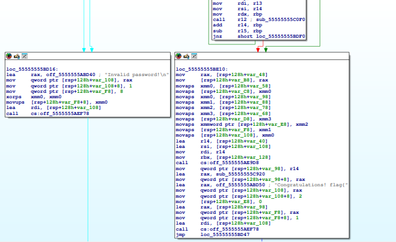
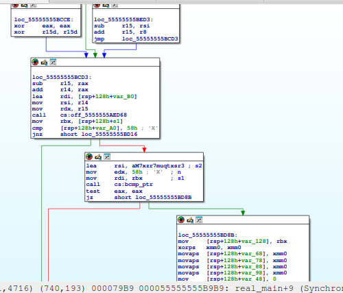
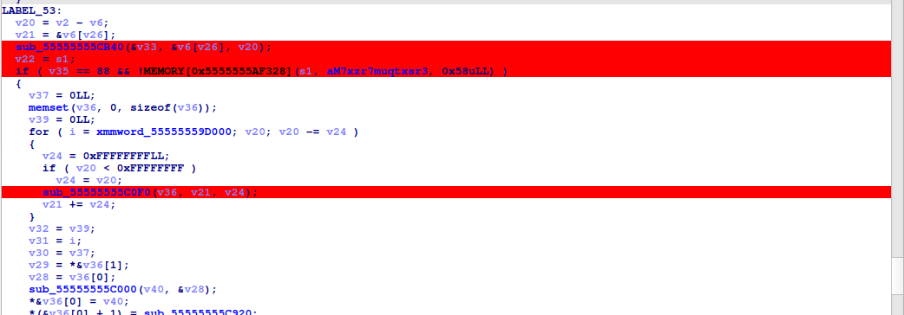
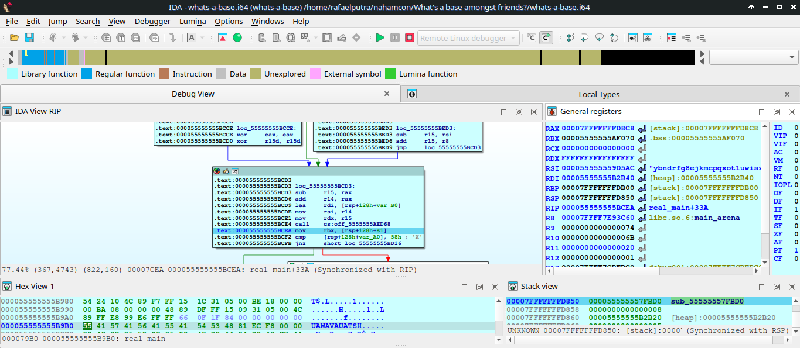
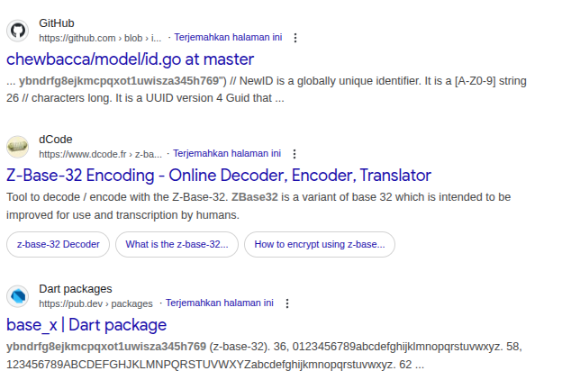
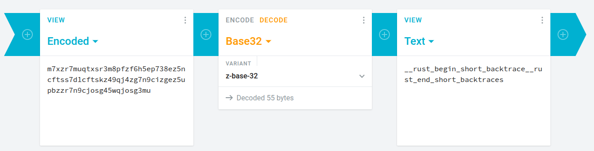

# What's a base amongst friends?

> What's a base amongst friends though, really?

Diberikan file whats-a-base, identifikasi filenya.

```
$ file whats-a-base 
whats-a-base: ELF 64-bit LSB pie executable, x86-64, version 1 (SYSV), dynamically linked, interpreter /lib64/ld-linux-x86-64.so.2, BuildID[sha1]=484060c717cdff4f3fd09b358136996ec7b7feaa, for GNU/Linux 3.2.0, stripped
```

Challenge ELF 64-bit, dengan binary di strip.

Ketika program dijalankan maka akan dimintai input password, dan jika passwordnya tidak sesuai maka program menampilkan output "Invalid password!"

Buka ke IDA, buka hasil disassembly dari fungsi main

```asm
.text:0000000000007F70 main            proc near               ; DATA XREF: start+18↑o
.text:0000000000007F70
.text:0000000000007F70 var_8           = qword ptr -8
.text:0000000000007F70
.text:0000000000007F70 ; __unwind {
.text:0000000000007F70                 push    rax
.text:0000000000007F71                 mov     rcx, rsi
.text:0000000000007F74                 movsxd  rdx, edi
.text:0000000000007F77                 lea     rax, sub_79B0
.text:0000000000007F7E                 mov     [rsp+8+var_8], rax
.text:0000000000007F82                 lea     rsi, unk_57CC8
.text:0000000000007F89                 mov     rdi, rsp
.text:0000000000007F8C                 xor     r8d, r8d
.text:0000000000007F8F                 call    cs:off_5AA90
.text:0000000000007F95                 pop     rcx
.text:0000000000007F96                 retn
.text:0000000000007F96 ; } // starts at 7F70
.text:0000000000007F96 main            endp
```

Terdapat pemanggilan fungsi sub_79B0, setelah di decompile ternyata ini adalah logika utama dari program.

```rust
__int64 real_main()
{
  __int64 v0; // rdx
  unsigned __int8 *v1; // rdx
  unsigned __int8 *v2; // r15
  unsigned __int8 *v3; // rsi
  char v4; // r8
  unsigned __int8 *v5; // r9
  unsigned __int8 *v6; // rax
  unsigned int v7; // r8d
  int v8; // r10d
  int v9; // ebx
  int v10; // r11d
  unsigned int v11; // r9d
  char v12; // r9
  unsigned __int8 *v13; // r8
  unsigned int v14; // r9d
  char v15; // r10
  char v16; // r11
  int v17; // r11d
  int v18; // r10d
  unsigned int v19; // r10d
  unsigned __int64 v20; // r15
  unsigned __int8 *v21; // r14
  void *v22; // rbx
  __int64 result; // rax
  __int64 v24; // rbp
  __int64 v25; // [rsp+8h] [rbp-120h] BYREF
  __int64 v26; // [rsp+10h] [rbp-118h]
  __int64 v27; // [rsp+18h] [rbp-110h]
  __int128 v28; // [rsp+20h] [rbp-108h] BYREF
  __m256i v29; // [rsp+30h] [rbp-F8h]
  __int128 v30; // [rsp+50h] [rbp-D8h]
  __int128 v31; // [rsp+60h] [rbp-C8h]
  __int64 v32; // [rsp+70h] [rbp-B8h]
  __int64 v33; // [rsp+78h] [rbp-B0h] BYREF
  void *s1; // [rsp+80h] [rbp-A8h]
  __int64 v35; // [rsp+88h] [rbp-A0h]
  _OWORD v36[3]; // [rsp+90h] [rbp-98h] BYREF
  __int128 v37; // [rsp+C0h] [rbp-68h]
  __int128 i; // [rsp+D0h] [rbp-58h]
  __int64 v39; // [rsp+E0h] [rbp-48h]
  _BYTE v40[64]; // [rsp+E8h] [rbp-40h] BYREF

  *&v28 = &off_5555555ABD18;
  *(&v28 + 1) = 1LL;
  v29.m256i_i64[0] = 8LL;
  *&v29.m256i_u64[1] = 0LL;
  sub_55555557A2B0(&v28);
  v25 = 0LL;
  v26 = 1LL;
  v27 = 0LL;
  *&v36[0] = sub_555555579930();
  if ( (sub_555555579960(v36, &v25) & 1) != 0 )
  {
    *&v28 = v0;
    sub_55555555B570(aCalledResultUn, 43LL, &v28, &off_5555555ABCF8, &off_5555555ABD28);
  }
  v1 = (v26 + v27);
  if ( v27 )
  {
    v2 = 0LL;
    v3 = v26;
    while ( 1 )
    {
      v5 = v3;
      v6 = v2;
      v7 = *v3;
      if ( (v7 & 0x80u) != 0 )
      {
        v8 = v7 & 0x1F;
        v9 = v3[1] & 0x3F;
        if ( v7 <= 0xDFu )
        {
          v3 += 2;
          v7 = v9 | (v8 << 6);
        }
        else
        {
          v10 = (v9 << 6) | v3[2] & 0x3F;
          if ( v7 < 0xF0u )
          {
            v3 += 3;
            v7 = (v8 << 12) | v10;
          }
          else
          {
            v3 += 4;
            v7 = ((v7 & 7) << 18) | (v10 << 6) | v5[3] & 0x3F;
          }
        }
      }
      else
      {
        ++v3;
      }
      v2 += v3 - v5;
      if ( v7 - 9 >= 5 && v7 != 32 )
      {
        if ( v7 < 0x80 )
          goto LABEL_26;
        v11 = v7 >> 8;
        if ( v7 >> 8 > 0x1F )
        {
          if ( v11 == 32 )
          {
            v4 = byte_5555555A2857[v7] >> 1;
          }
          else
          {
            if ( v11 != 48 )
              goto LABEL_26;
            v4 = v7 == 12288;
          }
        }
        else if ( v11 )
        {
          if ( v11 != 22 )
            goto LABEL_26;
          v4 = v7 == 5760;
        }
        else
        {
          v4 = byte_5555555A2857[v7];
        }
        if ( (v4 & 1) == 0 )
          goto LABEL_26;
      }
      if ( v3 == v1 )
        goto LABEL_52;
    }
  }
  v6 = 0LL;
  v2 = 0LL;
  v3 = v26;
LABEL_26:
  while ( v3 != v1 )
  {
    v13 = v1;
    v14 = *(v1 - 1);
    if ( (v14 & 0x80000000) != 0 )
    {
      v15 = *(v1 - 2);
      if ( v15 >= -64 )
      {
        v1 -= 2;
        v18 = v15 & 0x1F;
      }
      else
      {
        v16 = *(v1 - 3);
        if ( v16 >= -64 )
        {
          v1 -= 3;
          v17 = v16 & 0xF;
        }
        else
        {
          v1 -= 4;
          v17 = ((*(v13 - 4) & 7) << 6) | v16 & 0x3F;
        }
        v18 = (v17 << 6) | v15 & 0x3F;
      }
      v14 = (v18 << 6) | v14 & 0x3F;
      if ( v14 - 9 < 5 )
        continue;
    }
    else
    {
      --v1;
      if ( v14 - 9 < 5 )
        continue;
    }
    if ( v14 != 32 )
    {
      if ( v14 < 0x80 )
        goto LABEL_66;
      v19 = v14 >> 8;
      if ( v14 >> 8 > 0x1F )
      {
        if ( v19 == 32 )
        {
          v12 = byte_5555555A2857[v14] >> 1;
        }
        else
        {
          if ( v19 != 48 )
          {
LABEL_66:
            v2 = &v13[v2 - v3];
            goto LABEL_53;
          }
          v12 = v14 == 12288;
        }
      }
      else if ( v19 )
      {
        if ( v19 != 22 )
          goto LABEL_66;
        v12 = v14 == 5760;
      }
      else
      {
        v12 = byte_5555555A2857[v14];
      }
      if ( (v12 & 1) == 0 )
        goto LABEL_66;
    }
  }
  if ( !v27 )
  {
LABEL_52:
    v6 = 0LL;
    v2 = 0LL;
  }
LABEL_53:
  v20 = v2 - v6;
  v21 = &v6[v26];
  sub_55555555CB40(&v33, &v6[v26], v20);
  v22 = s1;
  if ( v35 == 88 && !MEMORY[0x5555555AF328](s1, aM7xzr7muqtxsr3, 0x58uLL) )
  {
    v37 = 0LL;
    memset(v36, 0, sizeof(v36));
    v39 = 0LL;
    for ( i = xmmword_55555559D000; v20; v20 -= v24 )
    {
      v24 = 0xFFFFFFFFLL;
      if ( v20 < 0xFFFFFFFF )
        v24 = v20;
      sub_55555555C0F0(v36, v21, v24);
      v21 += v24;
    }
    v32 = v39;
    v31 = i;
    v30 = v37;
    v29 = *&v36[1];
    v28 = v36[0];
    sub_55555555C000(v40, &v28);
    *&v36[0] = v40;
    *(&v36[0] + 1) = sub_55555555C920;
    *&v28 = &off_5555555ABD50;
    *(&v28 + 1) = 2LL;
    v29.m256i_i64[0] = v36;
    *&v29.m256i_u64[1] = 1uLL;
    result = sub_55555557A2B0(&v28);
  }
  else
  {
    *&v28 = &off_5555555ABD40;
    *(&v28 + 1) = 1LL;
    v29.m256i_i64[0] = 8LL;
    *&v29.m256i_u64[1] = 0LL;
    result = sub_55555557A2B0(&v28);
  }
  if ( v33 )
    result = sub_55555555BFB0(v22, v33, 1LL);
  if ( v25 )
    return sub_55555555BFB0(v26, v25, 1LL);
  return result;
}
```

Karena binarynya di stripped akan lebih sulit untuk identifikasi apa yang dilakukan oleh program. Langsung saja buka graph IDA untuk memvisualisasikan pengecekan input





Dari hasil graph IDA dapat dikira-kira beberapa fungsi yang bisa di breakpoint. 





Setelah di breakpoint dan melihat beberapa hasil nilai register, terdapat string mencurigakan di register RSI "ybndrfg8ejkmcpqxot1uwisza345h769std/src/io/buffered/bufwriter.rs", coba identifikasi apa itu "ybndrfg8ejkmcpqxot1uwisza345h769" di google.



Terdapat informasi bahwa string tersebut adalah set alfabet (berlaku juga untuk kapital) yang digunakan dalam z-base32 encoding.

Dari hasil disassembly tersebut terdapat perintah cmp untuk membandingkan [rsp+128h+var_A0] (input) dengan 58h (88 dalam desimal). Jika input ukurannya tidak sampai 88, maka program akan menampilkan output "Invalid password!". Ketika input ukurannya sudah sampai 88 maka akan lanjut ke perintah selanjutnya.

```asm
.text:000055555555BCFD lea     rsi, aM7xzr7muqtxsr3 ; s2
.text:000055555555BD04 mov     edx, 58h ; 'X'  ; n
.text:000055555555BD09 mov     rdi, rbx        ; s1
.text:000055555555BD0C call    cs:bcmp_ptr
.text:000055555555BD12 test    eax, eax
.text:000055555555BD14 jz      short loc_55555555BD8B
```

Terdapat perintah bcmp_ptr yang memiliki struktur fungsi bcmp_ptr(s1, s2, n), yang mana ini akan membandingkan n bytes antara s1 (input) dengan s2 (string yang sesuai (kemungkinan flagnya)). Ingat sebelum pemanggilan cmp awal terdapat value RSI yang berupa karakter yang digunakan dalam z-base32 encoding, bagaimana jika proses bcmp_ptr tersebut akan mengencode input ke z-base32 encoding dan akan membandingkan hasil yang sesuai (value dari aM7xzr7muqtxsr3)? Nilai dari aM7xzr7muqtxsr3 adalah m7xzr7muqtxsr3m8pfzf6h5ep738ez5ncftss7d1cftskz49qj4zg7n9cizgez5upbzzr7n9cjosg45wqjosg3mu, langsung coba decode.



Masukkan hasil decode tersebut ke file challenge

```bash
$ ./whats-a-base 
Enter the password: 
__rust_begin_short_backtrace__rust_end_short_backtraces
Congratulations! flag{50768fcb270edc499750ea64dc45ee92}
```

Didapatkan flagnya, flag{50768fcb270edc499750ea64dc45ee92}