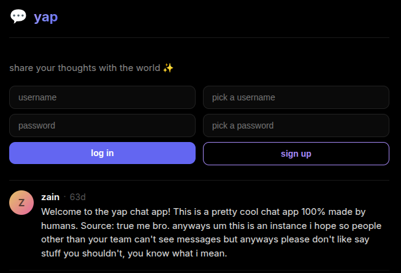
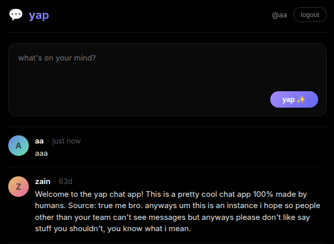
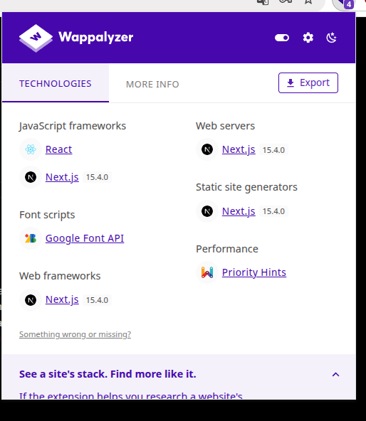
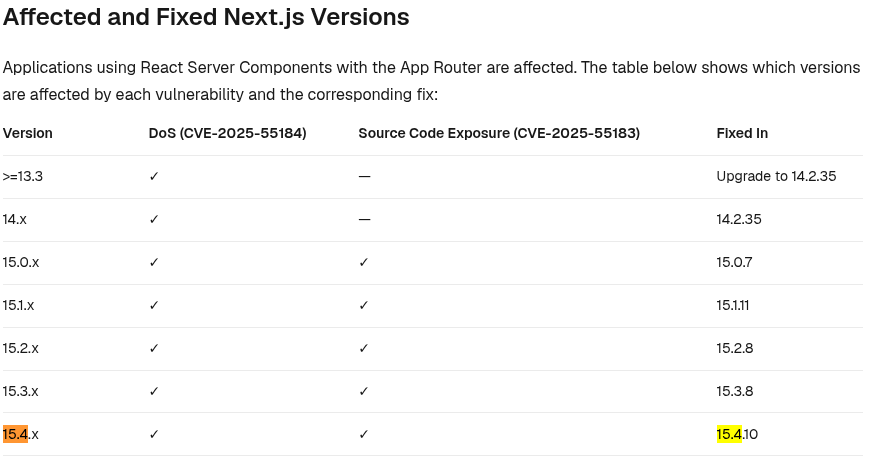

# vibecoded

> i vibe coded a website and told gpt to make it secure so there is nothing you can do now!!!

Pada challenge ini, tidak diberikan source code, ketika halaman webnya dibuka, terdapat fitur register dan login



Setelah register dan login, terdapat fitur untuk mengirimkan text yang nantinya akan disimpan dan ditampilkan di halaman yang sama



Karena tidak diberikan source code, coba analisis teknologi yang digunakan menggunakan wappalyzer



Ternyata website tersebut menggunakan reactjs dan nextjs. Versi nextjs yang digunakan adalah 15.4.0, cari vulnerability nextjs pada versi tersebut



Ternyata versi tersebut terdapat bug react2shell. Kita perlu cari exploitnya, saya menggunakan [ini](https://github.com/xalgord/React2Shell).

Setelah menjalankan exploit itu, terdapat flag.txt namun ternyata fake flag.

```
ubuntu@target:/app$ ls ../flag.txt
../flag.txt
ubuntu@target:/app$ cat ../flag.txt
tjctf{lmao_lock_in_stop_finding_f4k3s}
```

Coba cek folder tersembunyi dengan ls -a, dan terdapat file .git.

```
ubuntu@target:/app/.git$ ls
COMMIT_EDITMSG
HEAD
config
description
hooks
index
info
logs
objects
refs
```

Coba jalankan git log untuk melihat history commit.

```
ubuntu@target:/app/.git$ git log
commit 8e522db0209846f1941e9d675bdc12c9d36272d1
Author: yap-dev <dev@yapapp.com>
Date:   Fri May 15 10:57:21 2026 +0000

    remove sensitive config

commit 0692a5a01fa58dfd28e1e449a3e876c2f62162b0
Author: yap-dev <dev@yapapp.com>
Date:   Fri May 15 10:57:20 2026 +0000

    initial commit
```

Terdapat commit terbaru dengan pesan commit "remove sensitive config", kita coba kembalikan ke commit sebelumnya.

```
ubuntu@target:/app/.git$ git show 8e522db0209846f1941e9d675bdc12c9d36272d1
commit 8e522db0209846f1941e9d675bdc12c9d36272d1
Author: yap-dev <dev@yapapp.com>
Date:   Fri May 15 10:57:21 2026 +0000

    remove sensitive config

diff --git a/.env b/.env
deleted file mode 100644
index 958d9d6..0000000
--- a/.env
+++ /dev/null
@@ -1 +0,0 @@
-FLAG=tjctf{th1s_1s_Y_w3_d0nt_vibeeee_codeeee_sv3lte_ov3r_r34ct_any_d4y_r34ct_s3rv3r_c0mp0n3nts_CVE-2025-55182}
```

Didapatkan flagnya tjctf{th1s_1s_Y_w3_d0nt_vibeeee_codeeee_sv3lte_ov3r_r34ct_any_d4y_r34ct_s3rv3r_c0mp0n3nts_CVE-2025-55182}