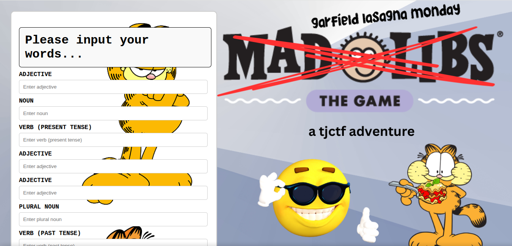
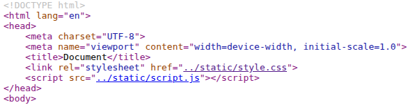
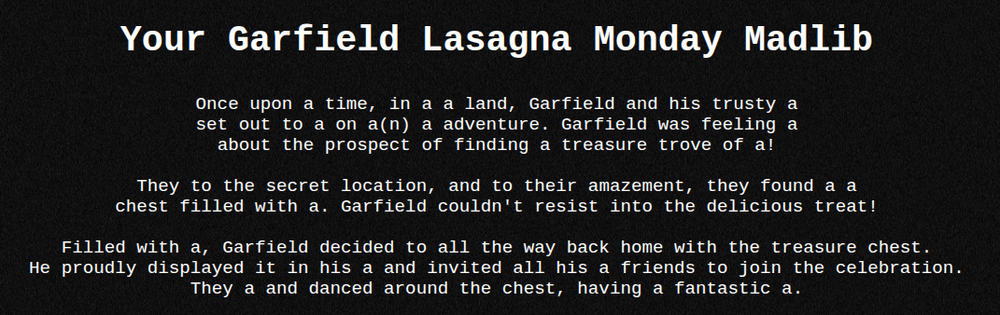
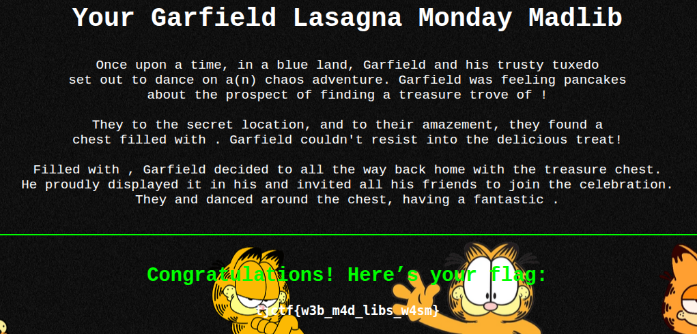

# garfield-lasagna-monday

> garfield will give you the flag if you can figure out his favorite few words to start a madlib.
garfield-lasagna-monday.tjc.tf

Ketika dibuka, terdapat form input yang kemungkinan akan dicek apakah kata yang diinput sesuai atau tidak.



Ketika di cek source codenya, terdapat pemanggilan script.js, tetapi ketika diakses ternyata Not Found.



Berikut adalah tampilan website setelah menerima input.



Pada source code website tersebut terdapat script javascript yang mungkin sebagai pengecekan input.

```javascript
<script>
    const w1 = "a",
          w2 = "a",
          w3 = "a",
          w4 = "a",
          w5 = "a";
  
    const checkInput = `${w1}|${w2}|${w3}|${w4}|${w5}`;
  
    fetch("/static/challenge.wasm")
      .then(resp => resp.arrayBuffer())
      .then(bytes => WebAssembly.instantiate(bytes, {}))
      .then(results => {
        const exports = results.instance.exports;
        const memory  = exports.memory;

        const ptr = 1024;
  
        const encoder    = new TextEncoder();
        const inputBytes = encoder.encode(checkInput);

        const u8 = new Uint8Array(memory.buffer);
  
        if (memory.buffer.byteLength < ptr + inputBytes.length + 1) {
          console.error(
            `Cannot write ${inputBytes.length + 1} bytes at offset ${ptr}. ` +
            `Memory is only ${memory.buffer.byteLength} bytes long!`
          );
          return;
        }
  
        u8.set(inputBytes, ptr);
        u8[ptr + inputBytes.length] = 0;
  
        if (exports.check(ptr) === 1) {
          const flagPtr = exports.get_flag();
  
          let out = "";
          let i   = flagPtr; // should be 0
          while (u8[i] !== 0) {
            out += String.fromCharCode(u8[i]);
            i++;
          }
  
          document.getElementById("flag").innerText = out;
          document.getElementById("flag-container").style.display = "block";
        }
      })
      .catch(err => console.error("Failed to load/instantiate challenge.wasm:", err));
</script>
```

Ternyata input yang akan diproses hanya w1, w2, w3, w4, dan w5 (word), kemudian akan digabungkan dengan tanda "|". Script tersebut juga melakukan pemanggilan challenge.wasm, setelah WASM tersebut di load, kumpulan input tadi akan diubah menjadi array UTF-8, kemudian ditulis di memori. Lalu terdapat kondisi `if (exports.check(ptr) === 1)` yang akan mencocokkan input dengan memanggil fungsi check, jika nilainya true, maka akan didapatkan fungsi get_flag yang akan diakses byte per byte.

Langsung saja download file challenge.wasm tersebut dan decompile untuk mendapatkan .wat dengan

`$ wasm2wat challenge.wasm -o challenge.wat` 

Di proses pencocokan input tadi fungsi check dipanggil, cari fungsi tersebut dalam file challenge.wat, di paling bawah file tersebut terdapat fungsi export yang menunjuk fungsi-fungsi.

```
(export "memory" (memory 0))
  (export "check" (func 1))
  (export "get_flag" (func 2))
  (export "__indirect_function_table" (table 0))
  (export "_initialize" (func 0))
  (export "__errno_location" (func 6))
  (export "stackSave" (func 3))
  (export "stackRestore" (func 4))
  (export "stackAlloc" (func 5))
  (elem (;0;) (i32.const 1) func 0))
```

Terlihat bahwa fungsi check berada pada `func 1` dan get_flag berada pada `func 2`.

```
(func (;1;) (type 1) (param i32) (result i32)
    (local i32)
    block  ;; label = @1
      local.get 0
      i32.load8_u
      i32.const 98
      i32.ne
      br_if 0 (;@1;)
      local.get 0
      i32.load8_u offset=1
      i32.const 108
      i32.ne
      br_if 0 (;@1;)
      local.get 0
      i32.load8_u offset=2
      i32.const 117
      i32.ne
      ...
```

Pada `func 1` terdapat inisialisasi ASCII code (98, 108, 117, dst), ketika dikonversi maka outputnya "blue|tuxedo|dance|chaos|pancakes", masukkan ke form input di awal, dan didapatkan flagnya tjctf{w3b_m4d_libs_w4sm}.

