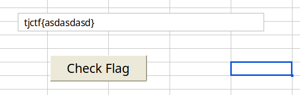
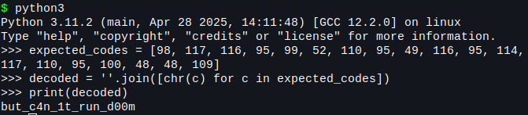

# guess-again

> What happens if you press the button?

Diberikan file excel yang ketika dibuka akan meminta input flag untuk di cek benar/salah.



Kemungkinan logika button "Check Flag" disimpan di dalam macro VBA (Visual Basic for Applications). Coba ekstrak VBA dengan olevba

`$ olevba chall.xlsm`

Benar saja terdapat fungsi pengecekan input.

```
Sub CheckFlag()
    Dim guess As String
    guess = ActiveSheet.Shapes("TextBox 1").TextFrame2.TextRange.Text

    If Len(guess) < 7 Then
        MsgBox "Incorrect"
        Exit Sub
    End If

    If Left(guess, 6) <> "tjctf{" Or Right(guess, 1) <> "}" Then
        MsgBox "Flag must start with tjctf{ and end with }"
        Exit Sub
    End If

    Dim inner As String
    inner = Mid(guess, 7, Len(guess) - 7)
    
    Dim expectedCodes As Variant
    expectedCodes = Array(98, 117, 116, 95, 99, 52, 110, 95, 49, 116, 95, 114, 117, 110, 95, 100, 48, 48, 109)
    Dim i As Long
    If Len(inner) <> (UBound(expectedCodes) - LBound(expectedCodes) + 1) Then
        MsgBox "Incorrect"
        Exit Sub
    End If
    For i = 1 To Len(inner)
        If Asc(Mid(inner, i, 1)) <> expectedCodes(i - 1) Then
            MsgBox "Incorrect"
            Exit Sub
        End If
    Next i
    
    MsgBox "Flag correct!"
End Sub
```

Tinggal decode expectedCodes menjadi string.

 

Didapatkan flagnya tjctf{but_c4n_1t_run_d00m}