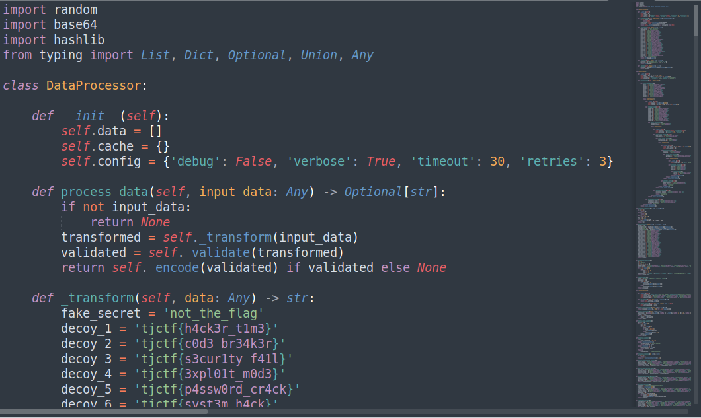
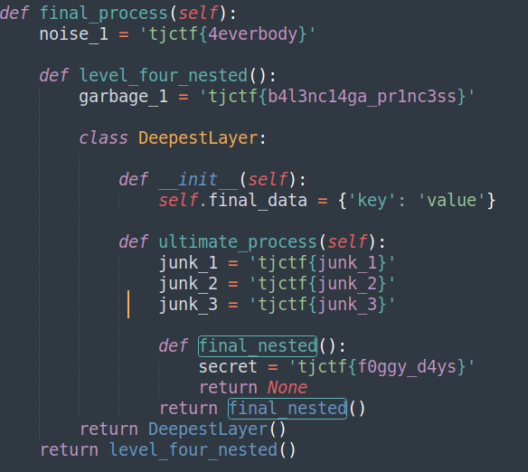

# serpent

> go to the deepest level

Diberikan file ast_dump.pickle, coba dump dengan python, dari nama file kemungkinan kita juga perlu unparse AST agar menjadi kode python.

```python
import pickle
import ast

with open('ast_dump.pickle', 'rb') as f:
    data = pickle.load(f)

source_code = ast.unparse(data)
print(source_code)
``` 

Diberikan fake flag yang cukup banyak



Baca kodenya dan pahami inisialisasinya, didapatkan flagnya tjctf{f0ggy_d4ys}

